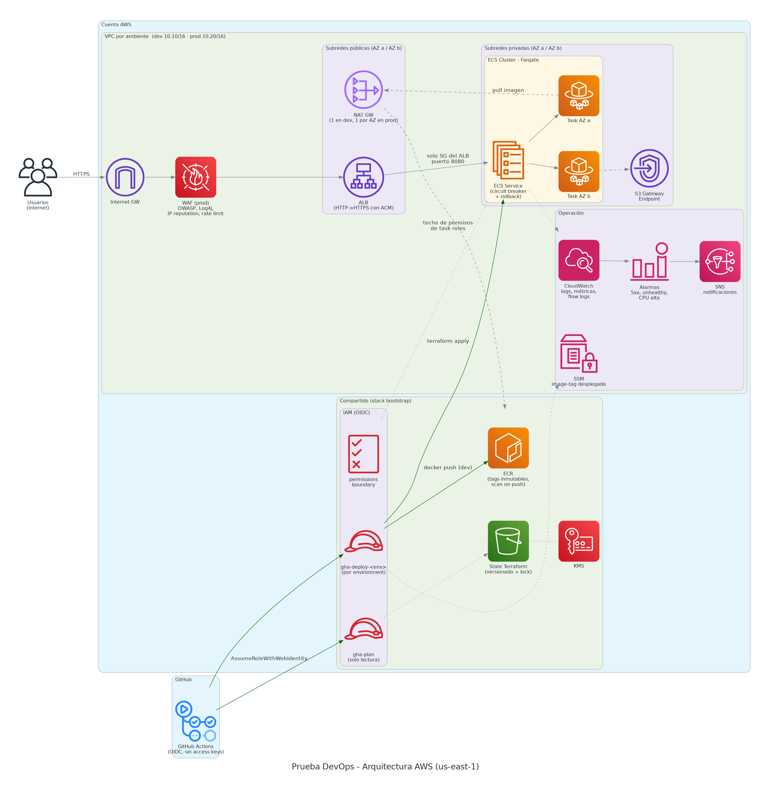
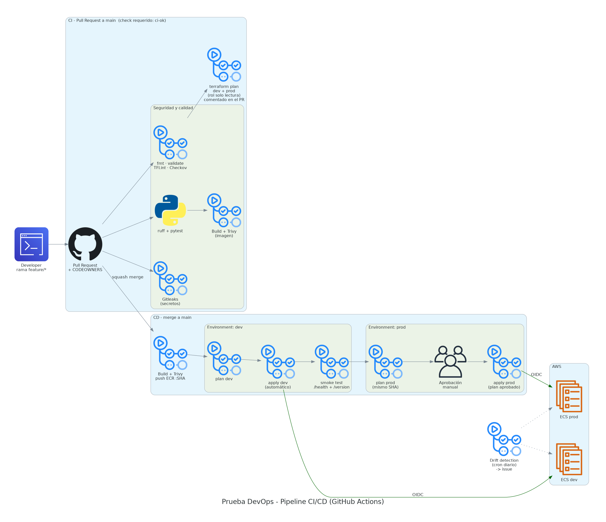

# Fase 2 — Propuesta de pipeline y arquitectura operativa

> Todo lo descrito aquí está **implementado y funcionando** en este repositorio:
> el ambiente `dev` está desplegado en AWS por el pipeline, y `prod` tiene
> plan + aprobación manual (el apply está apagado solo por costos con la
> variable `PROD_APPLY_ENABLED`).

## Índice

1. [Arquitectura e infraestructura (diagrama)](#1-arquitectura-e-infraestructura)
2. [Código Terraform y aprobación de cambios](#2-código-terraform-y-cómo-se-aprueban-los-cambios)
3. [Despliegue en DEV y luego en PROD](#3-despliegue-en-dev-y-después-en-prod)
4. [Estrategia de ramas, secretos y credenciales](#4-estrategia-de-ramas-manejo-de-secretos-y-credenciales)
5. [Decisión EC2 / ECS / EKS](#5-decisión-entre-ec2--ecs--eks)
6. [Escalado](#6-cómo-escala-la-solución)
7. [Controles de seguridad](#7-controles-de-seguridad)
8. [Zero Trust](#8-alineación-con-zero-trust)
9. [Casos prácticos](#9-casos-prácticos)

---

## 1. Arquitectura e infraestructura





Los diagramas son **código** (`docs/diagram/arquitectura.py`, librería `diagrams`) y se regeneran con `docs/diagram/generate.sh`: se versionan y revisan igual que la infraestructura.

| Capa | Componente | Decisión |
|------|-----------|----------|
| Entrada | ALB público + WAF (prod) | Única puerta pública. WAF con reglas administradas (OWASP, Log4j, IP reputation) y rate limit por IP. HTTPS con ACM cuando hay dominio. |
| Red | VPC por ambiente, 2 AZ | Subredes públicas solo para ALB y NAT. Contenedores en subredes **privadas**, sin IP pública. S3 Gateway Endpoint (gratis) para descargar capas de ECR sin pasar por NAT. VPC Flow Logs. |
| Cómputo | ECS Fargate | Sin servidores que parchear. Dev en Fargate Spot (≈70 % más barato); prod on-demand, mínimo 2 tareas (1 por AZ). |
| Imágenes | ECR compartido | Tags **inmutables**, scan on push, cifrado KMS. Una imagen se construye una vez y se promueve. |
| State | S3 + KMS + lock nativo | Versionado, cifrado, sin acceso público, TLS obligatorio. Una key por ambiente. |
| Identidad | OIDC GitHub → IAM | Cero access keys. Rol de plan (solo lectura) y un rol de deploy por ambiente. |
| Operación | CloudWatch + SNS | Logs, alarmas de 5xx, hosts no sanos y CPU sostenida; notificación por SNS. |

### Estructura del repositorio

```
app/                        API FastAPI + Dockerfile endurecido + tests
terraform/
  bootstrap/                state, KMS, ECR, OIDC, roles IAM, permissions boundary (1 sola vez)
  modules/
    network/                VPC, subredes, NAT, endpoints, flow logs
    alb/                    ALB, target group, listeners, WAF opcional
    ecs-service/            cluster, task def, service, autoscaling, alarmas
  envs/
    dev/                    main.tf + backend propio + terraform.tfvars
    prod/                   mismo código, otros valores, otro state, otro rol
.github/
  workflows/ci.yml          PR: seguridad + calidad + plan
  workflows/cd.yml          main: build → dev → smoke → aprobación → prod
  workflows/_terraform.yml  reutilizable: plan / apply por ambiente
  workflows/drift-detection.yml
  CODEOWNERS, dependabot.yml, pull_request_template.md
```

---

## 2. Código Terraform y cómo se aprueban los cambios

**Organización:** módulos reutilizables (`terraform/modules`) + un directorio por ambiente (`terraform/envs/<env>`). El código se escribe una vez; los ambientes solo cambian **valores** en `terraform.tfvars`:

| Parámetro | dev | prod |
|-----------|-----|------|
| NAT Gateway | 1 (compartido) | 1 por AZ (HA) |
| Capacidad | Fargate Spot | Fargate on-demand |
| Tareas min/max | 1 / 3 | 2 / 10 |
| CPU / memoria | 0.25 vCPU / 512 MB | 0.5 vCPU / 1 GB |
| WAF | no | sí |
| Deletion protection | no | sí |
| Container Insights | no | enhanced |
| Retención de logs | 14 días | 90 días |

Prefiero directorios en lugar de `terraform workspace` porque así cada ambiente tiene **su propio backend, su propio rol de AWS y su propio environment de GitHub**, y es imposible aplicar a prod "por estar en el workspace equivocado".

### Flujo de aprobación de un cambio de infraestructura

1. **Rama y PR.** Nadie puede hacer push a `main` (ruleset `main-protegida`): todo entra por Pull Request.
2. **Validación automática (CI).** En cada PR corren:
   - `terraform fmt -check`: formato consistente.
   - `terraform validate`: sintaxis y referencias.
   - **TFLint** (+ ruleset AWS): errores que validate no ve y convenciones.
   - **Checkov**: seguridad de la IaC. Cada excepción está escrita junto al recurso (`#checkov:skip=ID:razón`), así se revisa en el mismo PR.
   - **Gitleaks**: secretos en el código.
3. **Plan visible.** `terraform plan` de **dev y prod** con un rol de **solo lectura**, publicado como **comentario en el PR**. Si el plan destruye o reemplaza recursos, el comentario lo marca con una advertencia.
4. **Revisión humana.** CODEOWNERS obliga a que el dueño de `/terraform` y `/.github` apruebe. Las aprobaciones se descartan si llega un push nuevo, y la última persona que hizo push no puede ser quien aprueba.
5. **Merge (squash)** solo si el check `ci-ok` está en verde y hay aprobación.
6. **Apply del plan revisado.** En CD, `terraform apply tfplan` aplica **el archivo de plan**, no uno recalculado. Si alguien cambió el state en medio, Terraform lo rechaza (*saved plan is stale*).
7. **Prod requiere una segunda aprobación** en el GitHub Environment `prod`.

---

## 3. Despliegue en DEV y después en PROD

Principio: **build once, promote everywhere**. La imagen se construye **una sola vez**, se etiqueta con el **SHA del commit** y ese mismo artefacto es el que llega a prod.

```
merge a main
  └─ build-push     build → Trivy (bloquea HIGH/CRITICAL) → push ECR :<sha>
      └─ deploy-dev     plan → apply automático (environment dev)
          └─ smoke-dev      /health responde y /version == <sha>
              └─ deploy-prod    plan (mismo <sha>) → ⏸ aprobación manual → apply
```

- **DEV:** automático al hacer merge. El apply espera a que ECS quede estable (`wait_for_steady_state`). Si la versión nueva no pasa los health checks, el **circuit breaker** hace rollback solo y el pipeline falla.
- **Smoke test:** confirma que la URL responde y que dev corre **exactamente** el SHA esperado.
- **PROD:** el job de apply corre en el environment `prod`, que:
  - solo acepta despliegues desde `main`;
  - exige **aprobación de un revisor**;
  - es el único contexto que puede asumir el rol `gha-deploy-prod` (la trust policy OIDC valida `environment:prod`).
- **Rollback:** automático (circuit breaker) o manual con `workflow_dispatch` / revert del PR, que despliega el tag anterior. Como los tags son inmutables, "volver atrás" es volver a un SHA conocido.
- **Cambios solo de infraestructura:** el pipeline no reconstruye la imagen; lee el tag desplegado desde SSM (`/prueba-devops/<env>/image-tag`) para no cambiar la versión de la app sin querer.

---

## 4. Estrategia de ramas, manejo de secretos y credenciales

### Ramas: trunk-based development

- `main` es la **única rama de larga vida** y siempre es desplegable.
- Trabajo en ramas cortas `feat/*`, `fix/*`, `chore/*` → PR → squash merge.
- **No hay ramas por ambiente** (`dev`, `prod`). Los ambientes son **etapas del pipeline**, no ramas. Así se evita el *merge hell* y que prod tenga código que nunca pasó por dev.
- Hotfix: rama `fix/*` desde `main` → PR → mismo pipeline (no existe un camino "rápido" que salte controles).
- Reglas en `main`: PR obligatorio, 1 aprobación + CODEOWNERS, check `ci-ok`, historial lineal, sin force-push ni borrado.

### Credenciales de AWS: OIDC, cero llaves

| Rol | Quién lo asume (claim `sub`) | Permisos |
|-----|------------------------------|----------|
| `prueba-devops-gha-plan` | `pull_request` y `ref:refs/heads/main` | ReadOnly + lock del state. **Deny** explícito a leer secretos. |
| `prueba-devops-gha-deploy-dev` | solo `environment:dev` | Servicios de la app, limitados a `us-east-1`; state solo en `envs/dev/*`; push a ECR. |
| `prueba-devops-gha-deploy-prod` | solo `environment:prod` (con aprobación) | Igual, pero con state solo en `envs/prod/*` y **sin** push a ECR. |

- Las credenciales son **temporales** (STS, 1 h máximo) y cada sesión se llama `gha-<acción>-<env>-<run_id>`, así que en **CloudTrail se sabe qué run hizo qué**.
- Aunque alguien modifique un workflow en un PR, **no puede obtener el rol de prod**: ese token no trae `environment:prod`.
- Los roles que crea el pipeline (task roles de ECS) **deben** llevar el **permissions boundary** `prueba-devops-workload-boundary`, o IAM rechaza la creación. Así el pipeline no puede crear un rol más poderoso que ese techo, lo que evita que escale sus propios privilegios.
- Las únicas credenciales estáticas son las del administrador que corrió el **bootstrap** una sola vez. En una organización real serían credenciales SSO con MFA y temporales.

### Secretos de la aplicación

- **Nunca** en el repo ni en `tfvars`. Gitleaks en CI y *push protection* de GitHub lo bloquean.
- Se guardan en **Secrets Manager / SSM SecureString** cifrados con KMS, y ECS los inyecta en el contenedor al arrancar (`secrets` en la task definition). El valor **no pasa por Terraform ni por el pipeline**.
- En GitHub solo hay **variables** (ARNs de roles, que no son secretos). No hay ningún *secret* de AWS guardado.

---

## 5. Decisión entre EC2 / ECS / EKS

| Criterio | EC2 | **ECS Fargate** ✅ | EKS |
|----------|-----|-------------------|-----|
| Operación | Alta (SO, parches, AMIs) | **Muy baja** | Alta (upgrades, add-ons, CNI) |
| Costo fijo | Instancias 24/7 | **Solo tareas** | +USD 73/mes por plano de control |
| Curva de aprendizaje | Baja | **Baja** | Alta (Kubernetes) |
| Integración AWS | Manual | **Nativa** (IAM por tarea, ALB, Secrets) | Buena, con más piezas |
| Portabilidad multinube | Media | Baja | **Alta** |
| Escalado | Minutos (instancias) | **Segundos (tareas)** | Segundos (pods) + nodos |

**Elegí ECS Fargate** porque es una API stateless en contenedores, desplegada solo en AWS, con un equipo pequeño. Da el mejor balance entre seguridad (sin hosts que parchear, sin SSH), costo y velocidad de entrega.

**La arquitectura no queda amarrada a ECS.** El contrato con el cómputo es el módulo `ecs-service` (recibe imagen, subredes privadas, target group y SG del ALB). Cambiar de cómputo es cambiar ese módulo; red, ALB, pipeline, OIDC y aprobaciones no cambian:

- **Migrar a EKS** tendría sentido con decenas de microservicios, varios equipos compartiendo plataforma, requisitos multinube o necesidad de GitOps/operators. Sería un módulo `eks-cluster` con Karpenter + despliegue con Helm/ArgoCD.
- **Usar EC2** tendría sentido para cargas legadas, licencias por host o requisitos de kernel/hardware. Sería un módulo con ASG + launch template y acceso por SSM Session Manager (sin SSH).

---

## 6. Cómo escala la solución

**Aplicación (horizontal, automático):** Application Auto Scaling con **dos políticas de target tracking**; gana la que pide más capacidad:

1. **`ALBRequestCountPerTarget` = 500 req/min por tarea.** Mide la demanda real y reacciona antes que el CPU.
2. **CPU promedio = 60 %.** Protege contra solicitudes costosas.

- Scale-out rápido (cooldown 60 s) y scale-in conservador (300 s) para evitar oscilaciones.
- Límites: dev 1–3 tareas; prod 2–10 tareas (mínimo 2 = una por AZ).
- `desired_count` está en `ignore_changes`: el número de tareas lo decide el autoscaling y Terraform no lo "corrige".

**Infraestructura:**

- Fargate no requiere escalar nodos (AWS pone la capacidad).
- Alta disponibilidad multi-AZ (ALB, tareas y, en prod, un NAT por AZ).
- El ALB escala solo.

**Organización (crecer a más ambientes o equipos):**

- Agregar `qa` = copiar `envs/dev` con otro CIDR y otro `tfvars`, más un environment de GitHub.
- A gran escala: **una cuenta AWS por ambiente** (AWS Organizations + SCPs), para que el aislamiento entre ambientes sea total.

**Observabilidad del escalado:** alarma de **CPU > 85 % por 15 min**, que significa que el autoscaling no está alcanzando. Revisar `max_capacity` o un cuello de botella externo (base de datos, dependencia).

---

## 7. Controles de seguridad

| Etapa | Control | Qué previene |
|-------|---------|--------------|
| Código | **Gitleaks** (todo el historial) + GitHub push protection | Credenciales filtradas |
| Código | **ruff** con reglas de seguridad (bandit `S`) | Código inseguro en Python |
| Dependencias | **Dependabot** (actions, pip, docker, terraform) | Librerías con CVEs |
| Imagen | **Trivy** bloquea HIGH/CRITICAL corregibles; SARIF en la pestaña Security | Imágenes vulnerables en prod |
| Imagen | Multi-stage, usuario no root (10001), **sin pip** en runtime, root FS de solo lectura, `drop ALL` capabilities | Escalamiento dentro del contenedor |
| IaC | **Checkov** (248 checks) + **TFLint** | Buckets públicos, SG abiertos, falta de cifrado |
| IaC | Plan en el PR + CODEOWNERS + aprobación de prod | Cambios no revisados |
| IaC | `terraform apply` del plan guardado | Aplicar algo distinto a lo aprobado |
| Pipeline | Acciones **fijadas por SHA**, `permissions: {}` por defecto, `persist-credentials: false`, validado con **actionlint + zizmor** | Ataques de cadena de suministro en Actions |
| Credenciales | **OIDC**, roles por ambiente, **permissions boundary** | Llaves robadas, escalamiento de privilegios |
| Runtime | WAF, subredes privadas, SG por referencia, ECR inmutable + scan on push | Ataques web, movimiento lateral |
| Datos | KMS en state y ECR; TLS obligatorio en el bucket | Exposición de datos |
| Detección | **Drift detection** diaria → issue; VPC Flow Logs; CloudTrail | Cambios manuales, tráfico anómalo |

**Siguientes pasos recomendados para producción real:** GuardDuty + Security Hub, AWS Config con conformance packs, firma de imágenes (cosign/Notation) verificada antes del deploy, SBOM por build, access logs del ALB, una cuenta por ambiente con SCPs, e IAM Access Analyzer para recortar las políticas de deploy a lo realmente usado.

---

## 8. Alineación con Zero Trust

"Nunca confiar, siempre verificar", aplicado a cada flujo:

| Principio | Implementación |
|-----------|----------------|
| **Verificar explícitamente** | Cada job de GitHub presenta un token OIDC firmado; AWS valida repo + rama/environment antes de dar credenciales. Personas: SSO con MFA. |
| **Mínimo privilegio** | Plan = solo lectura. Deploy = un rol por ambiente, limitado a la región y a su propio state. Task role de la app sin permisos. Permissions boundary como techo. |
| **Acceso temporal** | Credenciales STS de máximo 1 h; nada permanente. |
| **Asumir brecha / segmentar** | Tareas en subredes privadas; solo aceptan tráfico **del SG del ALB** y en el puerto 8080. El ALB solo puede hablar con la VPC. El SG por defecto está vacío. VPC separada por ambiente. |
| **Sin puertos de administración** | No hay SSH ni bastión; `enable_execute_command = false`. Si hiciera falta acceso, sería SSM Session Manager con IAM + MFA y sesión auditada. |
| **Aprobación humana para lo crítico** | Prod exige revisor en el environment; CODEOWNERS en infra y pipelines. |
| **Monitoreo continuo** | CloudTrail (con nombre de sesión por run), Flow Logs, alarmas, detección de drift. |

---

## 9. Casos prácticos

### Caso 1 — "Un cambio pequeño en Terraform tumbó producción. ¿Qué revisarías primero?"

**Primero estabilizar, después investigar.**

1. **Contener:** ¿el circuit breaker ya hizo rollback? Si no, redesplegar la última versión buena: revert del PR → pipeline, o re-ejecutar el último CD exitoso. Comunicar el incidente.
2. **Ver el plan que se aplicó.** Está en el resumen del run y en el comentario del PR. Buscar las líneas `-/+ must be replaced` y `destroy`. El caso típico de un "cambio pequeño" que tumba prod es un **replace**: un atributo que obliga a recrear el recurso, como el nombre de un target group o de un SG, o el `name` de una task definition.
3. **Comparar qué cambió:** `git diff` del PR y el historial de versiones del state en S3 (versionado), para ver el antes y el después.
4. **CloudTrail**, filtrando por la sesión `gha-deploy-prod-<run_id>`: qué llamadas a la API se hicieron y en qué orden.
5. **Síntoma en runtime:** eventos del service de ECS, health checks del target group, logs de la app y reglas de SG. ¿Se cerró un puerto? ¿Cambió la ruta del health check?
6. **Prevenir que se repita:**
   - Bloquear el merge automáticamente si el plan de prod contiene destroy/replace sin una etiqueta de aprobación explícita.
   - `create_before_destroy` y `prevent_destroy` en los recursos críticos.
   - Exigir que el cambio pase primero por dev con el mismo plan.
   - Hacer un postmortem sin culpables.

### Caso 2 — "El pipeline falla solo en prod, pero en dev funciona bien. ¿Qué hipótesis revisarías?"

Es un problema de **diferencias entre ambientes**. Las hipótesis, en orden:

1. **Permisos:** el rol `gha-deploy-prod` tiene una política distinta, la trust policy no acepta el `sub` (¿el job corre en el environment `prod`? ¿desde `main`?), o hay una SCP de la cuenta u OU de prod que bloquea la acción. Revisar el `AccessDenied` en CloudTrail.
2. **Variables y configuración:** `terraform.tfvars` de prod con valores que dev no usa (WAF, deletion protection, NAT por AZ, Container Insights). **Esas ramas del código nunca se probaron en dev.**
3. **State:** lock tomado por un apply anterior interrumpido, *drift* en prod por un cambio manual, o recursos que ya existen fuera del state (*already exists*).
4. **Cuotas y límites** de la cuenta o región de prod: EIPs, NAT, tareas Fargate, reglas del WAF.
5. **Dependencias externas propias de prod:** certificado ACM, dominio o secretos que solo existen en prod, o que están vencidos.
6. **Protecciones:** `deletion_protection` o `prevent_destroy` que impiden un replace que en dev sí funcionó. En ese caso el error es **correcto**, está evitando un daño.
7. **Tiempos:** prod tiene más tareas y el despliegue tarda más que el timeout.

**Mejora estructural:** hacer que dev se parezca más a prod (activar las mismas funciones con capacidades más pequeñas), agregar un ambiente `staging` idéntico a prod, y mirar siempre el `plan` de prod en el PR, que ya se genera.

### Caso 3 — "El autoscaling de ECS no responde aunque la app está lenta."

"Lenta" no siempre significa "le falta capacidad". Revisaría:

1. **¿La métrica del autoscaling sube?** Si el cuello de botella es la base de datos, un API externo o I/O, el **CPU y los requests por tarea pueden estar normales** aunque la latencia sea alta. Agregar tareas no ayuda (y hasta empeora la base de datos). Revisar la latencia del target, métricas de la base de datos y trazas (X-Ray).
2. **¿La política está bien conectada?** Que exista el scalable target, que el `resource_label` (ALB/TG) sea el correcto y que las alarmas que crea el target tracking estén en `ALARM` y no en `INSUFFICIENT_DATA`. Revisar la **actividad de escalado**: `aws application-autoscaling describe-scaling-activities`.
3. **¿Ya llegó a `max_capacity`?** En ese caso no puede escalar más. Tenemos alarma de CPU sostenida para esto.
4. **¿Escala pero las tareas nuevas no llegan a servir tráfico?** Fallan el health check, no hay capacidad Fargate/Spot en la AZ, falta IP en la subred, se alcanzó la cuota de tareas, o el pull de la imagen falla (NAT/ECR). Revisar los **eventos del service**.
5. **¿Cooldowns o umbral mal calibrados?** Un target demasiado alto (por ejemplo, CPU 90 %) o un scale-out lento. Target tracking necesita varios minutos de datos antes de actuar.
6. **¿Se suspendió el escalado?** Un despliegue o alguien pudo suspender el scale-out. También puede que Terraform esté "peleando" con el `desired_count` (aquí se evita con `ignore_changes`).
7. **¿La métrica es la correcta?** Si la app es I/O-bound, escalar por CPU nunca se activa. Por eso aquí escala por **requests por tarea** además de CPU; otras opciones son una métrica de latencia p95 o la profundidad de una cola.
